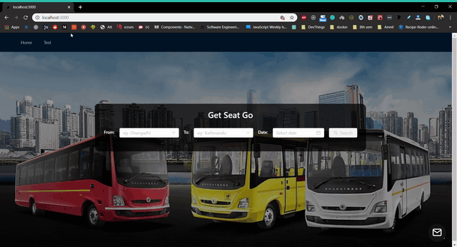

**_BookMyRide_**, an online bus booking system

<p>


>


</p>

## Demo (Client => NextJS): 


### To run -> 
* #### clone the entire repo
* #### go to server repo
* #### make environment file with the following keys' values:
```
MONGO_URI = "path to mongodb url"
userEmail = "your email"
userPass = "your password"
JWT_SECRET = "your secret here"
```
* #### yarn
* #### yarn server
* #### go to client repo
* #### yarn
* #### yarn dev


